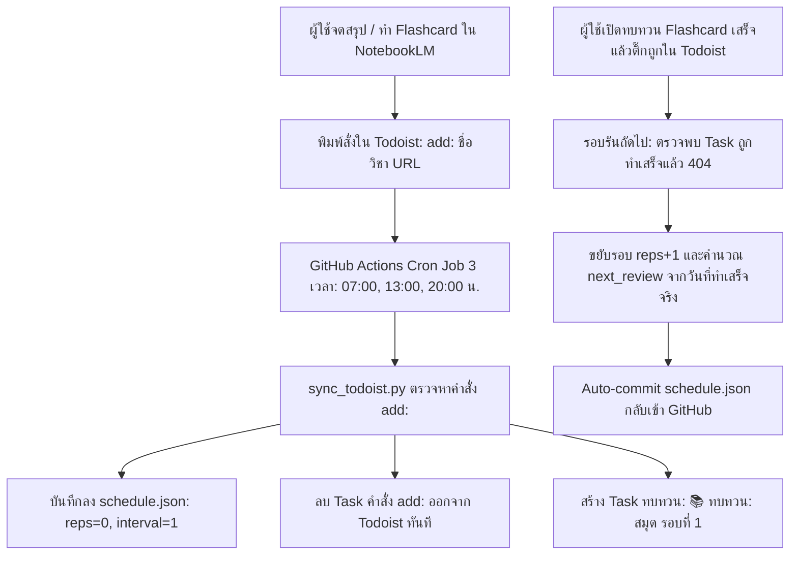

# 🧠 Google NotebookLM & Todoist Spaced Repetition Scheduler

ระบบ Serverless Spaced Repetition เชื่อมต่ออัตโนมัติระหว่าง **Google NotebookLM**, **Todoist** และ **GitHub Actions** (ฟรี 100% โดยไม่ต้องเปิดเซิร์ฟเวอร์)

---

## 🏗️ Architecture & Workflow



---

## ⚡ Spaced Repetition Logic (Interval Escalation)

1. **ลำดับช่วงห่างวันทบทวน:**
   - รอบที่ 1: `1 วัน`
   - รอบที่ 2: `3 วัน`
   - รอบที่ 3: `7 วัน`
   - รอบที่ 4: `16 วัน`
   - รอบที่ 5: `35 วัน`
   - รอบที่ 6: `75 วัน`
   - รอบที่ 7: `180 วัน`
   - รอบถัดไป: คูณ `2.2 เท่า` ของรอบก่อนหน้า
2. **กฎเหล็ก State-Aware:**
   - **หาก Task ใน Todoist ยังไม่ถูกติ๊กเสร็จ:** ระบบจะไม่ขยับวัน และไม่สร้าง Task ซ้ำ
   - **เมื่อตรวจพบว่าถูกติ๊กเสร็จแล้ว (Completed / 404):** เริ่มนับช่วงห่างจาก **"วันที่ทำเสร็จจริง"** เสมอ

---

## 🚀 วิธีตั้งค่าและเปิดใช้งาน (Step-by-Step)

### ขั้นตอนที่ 1: รับ Todoist API Token
1. เข้าเว็บ [Todoist App Console](https://app.todoist.com/app/settings/integrations/developer) หรือไปที่ **Settings > Integrations > Developer**
2. คัดลอกค่า **API token** ส่วนตัวของคุณเก็บไว้

### ขั้นตอนที่ 2: ตั้งค่า GitHub Repository Secret
1. ไปที่ GitHub Repository ของคุณ
2. เมนู **Settings** > **Secrets and variables** > **Actions**
3. คลิกปุ่ม **New repository secret**
   - **Name:** `TODOIST_API_TOKEN`
   - **Secret:** วาง API Token ที่ได้จากขั้นตอนที่ 1
4. คลิก **Add secret**

### ขั้นตอนที่ 3: เปิดสิทธิ์ Workflow Write Permissions (สำคัญมาก ⚠️)
เพื่อให้ GitHub Actions สามารถ commit ไฟล์ `schedule.json` กลับมายัง Repository ได้:
1. ไปที่ **Settings** > **Actions** > **General**
2. เลื่อนลงมาที่หัวข้อ **Workflow permissions**
3. เลือก **Read and write permissions**
4. คลิก **Save**

### ขั้นตอนที่ 4: ทดสอบการทำงาน (Manual Trigger)
1. ไปที่แท็บ **Actions** ใน GitHub Repository
2. เลือก workflow **Spaced Repetition Scheduler**
3. คลิกปุ่ม **Run workflow** เพื่อทดสอบรันทันทีโดยไม่ต้องรอ Cron

---

## 📝 วิธีใช้งานในชีวิตประจำวัน

### 1. เพิ่มสมุดใหม่ (Zero-effort Add)
พิมพ์สร้าง Task ใหม่ใน Todoist ด้วยรูปแบบใดก็ได้ ดังนี้:

- แบบทั่วไป:
  ```text
  add: สรุปวิชาระบบประสาท https://notebooklm.google.com/notebook/your-notebook-id
  ```
- แบบ Markdown Link:
  ```text
  add: [System Design Notes](https://notebooklm.google.com/notebook/your-notebook-id)
  ```
- หรือพิมพ์ชื่อในช่อง Task แล้วใส่ URL ในช่อง Description:
  - Task: `add: Machine Learning 101`
  - Description: `https://notebooklm.google.com/notebook/your-notebook-id`

### 2. เมื่อระบบรัน
1. Task คำสั่ง `add:` จะถูกลบออกอัตโนมัติ
2. ระบบจะสร้าง Task ทบทวนสำหรับวันนี้:
   `📚 ทบทวน: [ชื่อวิชา](URL) (รอบที่ 1)`
3. เมื่อคุณอ่านและทำ Flashcard เสร็จ ให้**กดติ๊กถูก (Complete)** Task นั้น
4. ระบบจะคำนวณวันทบทวนรอบถัดไปให้อัตโนมัติ!

---

## 🛠️ โครงสร้างไฟล์ในโปรเจกต์

| ไฟล์ / โฟลเดอร์ | หน้าที่ |
| :--- | :--- |
| `schedule.json` | ฐานข้อมูล State เก็บประวัติ reps, interval, วันที่ทบทวนรอบถัดไป |
| `sync_todoist.py` | สคริปต์หลักจัดการ Spaced Repetition Engine และเชื่อมต่อ Todoist API |
| `requirements.txt` | Dependency สำหรับรันสคริปต์ (`requests>=2.31.0`) |
| `.github/workflows/daily_schedule.yml` | GitHub Actions ตั้งเวลารันอัตโนมัติวันละ 3 รอบ |
| `tests/test_sync.py` | Unit tests ครอบคลุม parsing, spaced repetition calculation และ sync flow |
