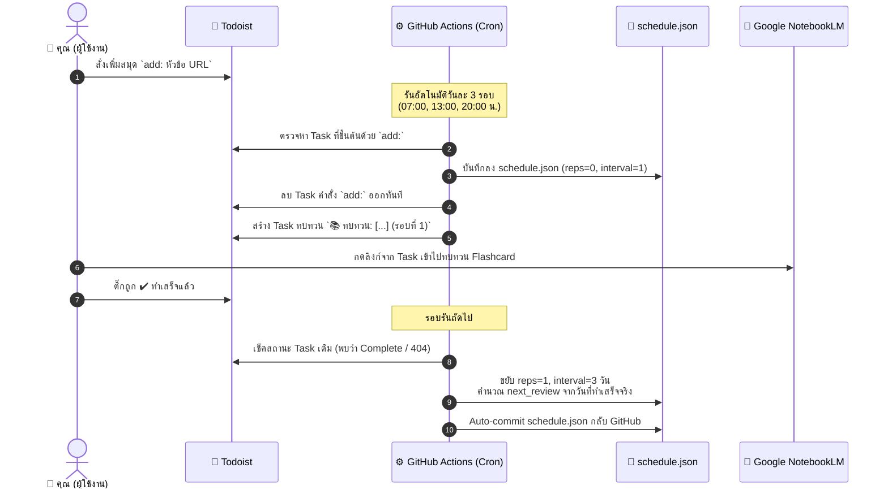

# 📖 คู่มือการใช้งานระบบ NotebookLM & Todoist Spaced Repetition

คู่มือฉบับสมบูรณ์สำหรับการตั้งค่าและใช้งานระบบ Spaced Repetition เชื่อมต่ออัตโนมัติระหว่าง **Google NotebookLM**, **Todoist** และ **GitHub Actions** (Serverless 100% ไม่มีค่าใช้จ่าย)

---

## 📌 สารบัญ
1. [ภาพรวมการทำงาน (Architecture & Concept)](#1-ภาพรวมการทำงาน-architecture--concept)
2. [การตั้งค่าเริ่มต้นครั้งแรก (Initial Setup)](#2-การตั้งค่าเริ่มต้นครั้งแรก-initial-setup)
3. [วิธีใช้งานในชีวิตประจำวัน (Daily Usage)](#3-วิธีใช้งานในชีวิตประจำวัน-daily-usage)
4. [ตารางระยะเวลาทบทวน (Spaced Repetition Schedule)](#4-ตารางระยะเวลาทบทวน-spaced-repetition-schedule)
5. [การทดสอบรันในเครื่อง (Local Testing)](#5-การทดสอบรันในเครื่อง-local-testing)
6. [คำถามที่พบบ่อยและการแก้ปัญหา (FAQ & Troubleshooting)](#6-คำถามที่พบบ่อยและการแก้ปัญหา-faq--troubleshooting)

---

## 1. ภาพรวมการทำงาน (Architecture & Concept)

ระบบนี้ออกแบบตามแนวคิด **Zero-effort Workflow** โดยที่คุณไม่ต้องเปิดหน้าเว็บอื่นหรือจัดการฐานข้อมูลเอง:



---

## 2. การตั้งค่าเริ่มต้นครั้งแรก (Initial Setup)

ทำเพียง **ครั้งเดียว** ใช้เวลาไม่เกิน 3 นาที:

### ขั้นตอนที่ 2.1: ขอ Todoist API Token
1. เปิดเบราว์เซอร์แล้วล็อกอินเข้า Todoist
2. ไปที่ **[Todoist Integrations Developer](https://app.todoist.com/app/settings/integrations/developer)**
3. เลื่อนลงมาที่หัวข้อ **API token** แล้วกด **Copy to clipboard**

> [!IMPORTANT]
> API Token นี้เป็นกุญแจสำคัญ ห้ามแชร์ให้ผู้อื่นเด็ดขาด

---

### ขั้นตอนที่ 2.2: ใส่ Secret ใน GitHub Repository
1. เข้าไปยัง GitHub Repository ของโปรเจกต์นี้
2. ไปที่แท็บ **Settings** ด้านบน
3. เมนูด้านซ้าย เลือก **Secrets and variables** > **Actions**
4. คลิกปุ่ม **New repository secret** สีเขียว
5. กรอกข้อมูล:
   - **Name:** `TODOIST_API_TOKEN`
   - **Secret:** วาง API Token ที่คัดลอกมา
6. กดปุ่ม **Add secret**

---

### ขั้นตอนที่ 2.3: เปิดสิทธิ์ให้ Workflow เขียนไฟล์ได้ (สำคัญมาก ⚠️)
ระบบต้องบันทึกประวัติการทบทวนลงใน `schedule.json` กลับมาที่ Git จึงต้องเปิดสิทธิ์ Write:
1. อยู่ในหน้า **Settings** ของ GitHub Repository
2. เมนูด้านซ้าย เลือก **Actions** > **General**
3. เลื่อนลงมาด้านล่างสุดที่หัวข้อ **Workflow permissions**
4. เลือก **Read and write permissions**
5. ติ๊กถูกที่ช่อง **Allow GitHub Actions to create and approve pull requests** (ถ้ามี)
6. กดปุ่ม **Save**

---

### ขั้นตอนที่ 2.4: Push โค้ดขึ้น GitHub
เปิด Terminal ในโฟลเดอร์นี้ แล้วสั่ง push โค้ดทั้งหมดขึ้น GitHub:

```bash
git push -u origin main
```

---

## 3. วิธีใช้งานในชีวิตประจำวัน (Daily Usage)

### 3.1 การเพิ่มสมุดใหม่ (Add New Notebook)
เมื่อคุณสร้างสมุดและ Flashcard ใน Google NotebookLM เสร็จแล้ว ให้คัดลอก URL ของสมุดนั้นมาสั่งใน Todoist ได้ทันที รองรับ 3 รูปแบบ:

#### แบบที่ 1: พิมพ์ต่อกันในช่องชื่องาน (แนะนำ ง่ายที่สุด)
```text
add: สรุปวิชาคณิตศาสตร์ https://notebooklm.google.com/notebook/xxxxxxxx-xxxx-xxxx-xxxx-xxxxxxxxxxxx
```

#### แบบที่ 2: ใส่เป็น Markdown Link
```text
add: [สรุปวิชาชีววิทยา](https://notebooklm.google.com/notebook/xxxxxxxx-xxxx-xxxx-xxxx-xxxxxxxxxxxx)
```

#### แบบที่ 3: พิมพ์ชื่อในช่อง Task แล้ววาง URL ใน Description
- **Task Title:** `add: System Design`
- **Description:** `https://notebooklm.google.com/notebook/xxxxxxxx-xxxx-xxxx-xxxx-xxxxxxxxxxxx`

---

### 3.2 เมื่อระบบตรวจพบคำสั่ง
เมื่อถึงรอบเวลารัน (07:00, 13:00, หรือ 20:00 น.) หรือคุณกดรันเอง:
1. Task คำสั่ง `add:` จะ**ถูกลบออกอัตโนมัติ**
2. Task ทบทวนจะถูกสร้างขึ้นมาแทนที่ใน Todoist:
   - **ชื่องาน:** `📚 ทบทวน: [สรุปวิชาคณิตศาสตร์](URL) (รอบที่ 1)`
   - **คำอธิบาย:** `เปิด NotebookLM ทบทวน Flashcard เสร็จแล้วกดติ๊กถูกเพื่อเริ่มนับรอบต่อไป`
   - **กำหนดส่ง (Due Date):** `Today`

---

### 3.3 การทบทวนและกดทำเสร็จ (Complete Review)
1. ใน Todoist ให้คลิกที่ลิงก์ในชื่องานเพื่อเปิด NotebookLM ทันที
2. ทำการอ่านสรุป หรือทบทวน Flashcard ในสมุดเล่มนั้น
3. เมื่อทบทวนเสร็จแล้ว ให้**กดติ๊กถูก (Complete) งานใน Todoist**
4. ในรอบรันถัดไป ระบบจะตรวจพบว่างานนี้เสร็จแล้ว และจะกำหนดวันทบทวนรอบถัดไปให้คุณอัตโนมัติ

> [!TIP]
> **ระบบฉลาด ไม่เร่งงาน (State-Aware):**  
> หากถึงกำหนดทบทวนแล้วแต่คุณยังไม่ว่างทำ และยังไม่ได้ติ๊กถูกใน Todoist -> **ระบบจะไม่ขยับวัน และไม่ส่งงานซ้ำเด็ดขาด** จนกว่าคุณจะทบทวนเสร็จจริง จึงจะเริ่มนับวันรอบถัดไปจากวันที่คุณทำเสร็จ

---

### 3.4 การลบสมุดทิ้งอย่างถาวร (Delete / Drop Notebook)
หากคุณสอบผ่านวิชานั้นแล้ว หรือต้องการเลิกทบทวนสมุดเล่มนั้นอย่างถาวร (ไม่ให้ระบบนำกลับมารันอีก):

#### วิธีที่ 1: สั่งลบผ่าน Todoist ได้โดยตรง (สะดวกที่สุด แนะนำ ⭐)
คุณสามารถพิมพ์คำสั่งใน Todoist ได้เลย โดยขึ้นต้นด้วย `drop:`, `delete:`, `del:`, หรือ `remove:` ตามด้วย**ชื่อวิชา** หรือ **URL ของสมุด**:

- **ระบุด้วยชื่อวิชา (หรือคำค้นย่อ):**
  ```text
  drop: สรุปวิชาคณิตศาสตร์
  ```
- **หรือระบุด้วย URL ของสมุด:**
  ```text
  delete: https://notebooklm.google.com/notebook/xxxxxxxx-xxxx-xxxx-xxxx-xxxxxxxxxxxx
  ```
- **เมื่อระบบรันรอบถัดไป (หรือคุณกด Run workflow):**
  1. ระบบจะค้นหาและ**ลบสมุดเล่มนั้นออกจาก `schedule.json` อย่างถาวร**
  2. หากมี Task ทบทวน `📚 ทบทวน: [...]` ค้างอยู่ใน Todoist ระบบจะ**ลบทิ้งให้ด้วยทันที**
  3. ลบ Task คำสั่ง `drop:` นั้นออกจาก Todoist ให้เรียบร้อย สะอาด 100%

#### วิธีที่ 2: ลบผ่านไฟล์ `schedule.json` บน GitHub (Manual)
1. เปิดเข้าไปที่ไฟล์ [`schedule.json`](file:///schedule.json) ใน GitHub Repository
2. กดไอคอนรูปดินสอเพื่อแก้ไข (Edit)
3. ลบทั้งบล็อก `{ ... }` ของสมุดเล่มที่ต้องการออก แล้วกด **Commit changes**
4. หากมี Task ทบทวนค้างอยู่ใน Todoist สามารถกด Delete Task นั้นใน Todoist ทิ้งได้เลย

---

## 4. ตารางระยะเวลาทบทวน (Spaced Repetition Schedule)

ระบบใช้ตารางทบทวนแบบสมองลืม (Forgetting Curve Escalation):

| รอบที่ | ระยะห่าง (Interval) | ตัวอย่าง (หากทำเสร็จวันที่ 1 ม.ค.) |
| :---: | :---: | :---: |
| **รอบที่ 1** | ทันทีที่เพิ่ม / วันนี้ | 1 มกราคม |
| **รอบที่ 2** | + 3 วัน | 4 มกราคม |
| **รอบที่ 3** | + 7 วัน | 11 มกราคม |
| **รอบที่ 4** | + 16 วัน | 27 มกราคม |
| **รอบที่ 5** | + 35 วัน | 3 มีนาคม |
| **รอบที่ 6** | + 75 วัน | 17 พฤษภาคม |
| **รอบที่ 7** | + 180 วัน | 13 พฤศจิกายน |
| **รอบที่ 8+** | คูณ `2.2` เท่าจากรอบก่อน | ทบทวนระยะยาวระดับปี |

---

## 5. การทดสอบรันในเครื่อง (Local Testing)

คุณสามารถทดสอบการทำงานในเครื่องคอมพิวเตอร์ของคุณได้โดยไม่ต้องรอ GitHub Actions:

### 5.1 รัน Unit Tests ทั้งหมด
เพื่อตรวจสอบความถูกต้องของ Logic:
```bash
python -m unittest discover tests
```

### 5.2 จำลองการทำงาน (Dry Run Mode)
ทดสอบอ่านค่าจาก Todoist และคำนวณโดยไม่ลบหรือเพิ่ม Task จริงใน Todoist และไม่แก้ไฟล์จริง:
```bash
python sync_todoist.py --dry-run
```

### 5.3 รันจริงผ่าน Terminal
```powershell
# บน Windows PowerShell
$env:TODOIST_API_TOKEN="your_token_here"
python sync_todoist.py
```

---

## 6. คำถามที่พบบ่อยและการแก้ปัญหา (FAQ & Troubleshooting)

### Q1: สามารถกดสั่งรันทันทีโดยไม่ต้องรอรอบเวลา 07:00, 13:00, 20:00 ได้ไหม?
**ได้ครับ:**
1. ไปที่แท็บ **Actions** ใน GitHub Repository ของคุณ
2. ในแถบด้านซ้ายคลิกเลือก **Spaced Repetition Scheduler**
3. คลิกปุ่ม **Run workflow** ทางด้านขวา แล้วเลือก Branch `main` จากนั้นกดปุ่มสีเขียว **Run workflow**

---

### Q2: ถ้าอยากเปลี่ยนเวลารัน ต้องแก้ที่ไหน?
แก้ไขที่ไฟล์ [`.github/workflows/daily_schedule.yml`](file:///.github/workflows/daily_schedule.yml):
ตรงส่วน `cron`:
```yaml
on:
  schedule:
    # เวลาใน GitHub Actions เป็นเวลา UTC (ไทย = UTC+7)
    # เช่น อยากรันเวลา 08:00 และ 18:00 เวลาไทย (ลบออก 7 ชม. = 01:00 และ 11:00 UTC)
    - cron: '0 1,11 * * *'
```

---

### Q3: GitHub Actions ขึ้น Error: `Permission to ... denied to github-actions[bot]`
**สาเหตุ:** ยังไม่ได้เปิดสิทธิ์ Write Permission ให้กับ Actions  
**วิธีแก้:** ไปที่ **Settings** > **Actions** > **General** > เลื่อนลงไปที่ **Workflow permissions** แล้วเลือก **Read and write permissions** จากนั้นกด **Save**

---

### Q4: ถ้าเผลอกดติ๊กถูกใน Todoist ทั้งที่ยังไม่ได้ทบทวน ทำอย่างไร?
เปิดไฟล์ [`schedule.json`](file:///schedule.json) ใน GitHub แล้วแก้ตัวเลข `reps` และ `next_review` ให้กลับมาเป็นวันที่ต้องการ แล้ว commit ได้เลย

---

### Q5: ถ้ามีหลายสมุดพร้อมกัน ระบบจะรองรับได้ไหม?
รองรับได้ไม่จำกัดจำนวนเล่ม ระบบจะเก็บข้อมูลแต่ละเล่มแยกจากกันอย่างอิสระใน `schedule.json` และมีระบบป้องกันการเพิ่ม URL เดียวกันซ้ำ (Deduplication) ให้เรียบร้อย
